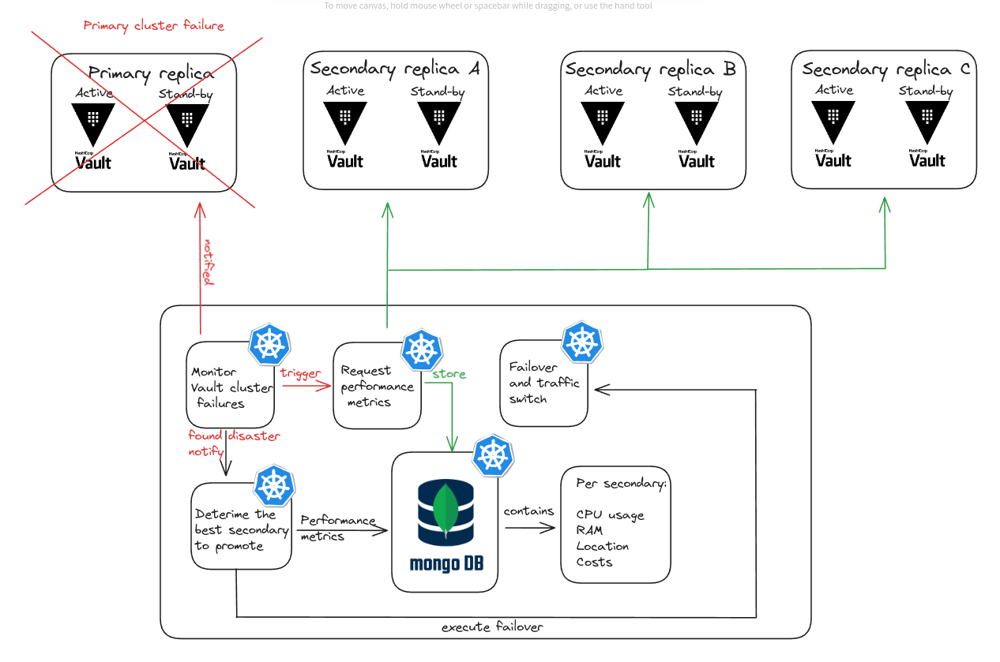

# Vault Automatic Diasater Recovery System 

This repository contains a Proof-of-Concept(POC) of an automatic disaster recovery system for Vault replicas which are deployed in different environments. Primarily, the current implementation of system does not adhere to production requirements but mainly represents the technical considerations and main decisions taken to represent the architecture at its incipient state.

## System Overview

The system architecture comprises several clusters:

**Monitoring Cluster**: Tracks Vault cluster failures continuously. If the primary cluster fails, it notifies the Metrics cluster to collect the performance metrics from each available secondary Vault replica and lets the Decision cluster undergo the next steps in finding the best secondary cluster to promote.

**Metrics Cluster**: Queries Vault clusters to gather performance metrics. These metrics are stored in a MongoDB database for analysis.

**Decision Cluster**: Selects the best secondary replica to replace the failed primary based on metrics collected by the Metrics cluster.

**Failover Cluster**: Responsible for promoting the selected secondary replica to the primary one and maintains operational flow.

**Note:** Due to time constraints and the fact that this is a POC, we will not deploy each service of our system inside Kubernetes because, for now, each system executes the minimum requirements and deplying them will not add up much to the end value. We also note that this is just the first step towards such a feature, which if done properly, with all the considerations takes and complex processes in place, then deploying them would make much sense. Also, as this is just an experiment, and not a production environment, where availability is pivotal, deploying these services is not paramount. 

## Workflow

- Next, we deploy one primary Vault cluster and three secondary clusters. In order to make the clusters operational, a script is used to unseal the cluster with three unseal keys and a root token provided by the Vault service when it is first initialized. After this step, the vault cluster can be ready to interact with.

- A client creates a secret once and then continuously listens for secrets from the primary Vault cluster. This is not exactly how services use Vault in production, but for a POC, we would like to simulate a stressful scenario, where the secret will be needed continuously, rather than once in a while.

- Before we trigger the failure of the primary Vault cluster, we run a stress test in order to increase the Kuberenets pod resources of each replica. This would make the experiment slightly closer to real life scenarios.

- In case of primary cluster failure, the Monitoring cluster detects the failure and notifies the Metrics and Decision cluster to execute their part.
- The Metrics cluster queries performance indicators from Vault replicas and stores them in MongoDB.
- The Decision cluster selects the best secondary replica based on the collected metrics.
- The Failover cluster promotes the chosen secondary replica to the primary role, ensuring continuity of operations.

# Stress Testing

Before triggering a fault in the primary Vault cluster, stress testing is performed to ensure optimal performance metrics. This involves subjecting the system to various load conditions to extract its resilience and responsiveness under stress.

## Repository Structure

- VaultClusters/: Contains deployment configurations for Vault clusters.
    - ChaosTest/: deploys a [StressChaos](https://chaos-mesh.org/docs/simulate-heavy-stress-on-kubernetes/) instance for each vault cluster.
- Client/: Includes code for the client application that creates and retreives secrets from the primary Vault cluster.
- System/: contains the logic of each service in our system.
    - MonitoringService/
    - RequestMetrics/
    - DecisionService/
    - FailoverService/
    - Utils/: Contains the implementation of a [MongoClient](https://pymongo.readthedocs.io/en/stable/tutorial.html) that interacts with the database.
        - MongoDB/: Contains the Kubernetes configurations for deploying a mongo image.

## Technologies
- We use **Kubernetes v1.29.2** to deploy the Vault clusters running in Docker containers. The Vault image is not the latest one, as Vault does not privide consistent open-source resleases, however, it is a suitable approach for a POC, rather than using vanilla Kubernetes to simulate Vault.
- For a couple of scripts, we decided to use **Python**. For instance, to implement a client or to interact with MongoDB, Python is the most lightweight tool we decided on.
- We heavily used **Bash** scripts as this is the most straight-forward way to interact with Kubernetes deployments/pods/services.
- For storing performance metrics, we used MongoDB deployed in Kubernetes with a publicly available Docker image.
- Lastly, to interact with the Vault clusters, we used **Vault CLI v1.15.6**

## Prerequisites:
- Install [Kubernetes minikube](https://minikube.sigs.k8s.io/docs/start/) which enables you to run Kubernetes clusters locally on your machine. 

- Install `kubectl` [using this guide](https://kubernetes.io/docs/tasks/tools/#kubectl). This is the Kubernetes CLI and allows you to interact with these resources.

- Install Valut CLI by following [these options](https://developer.hashicorp.com/vault/docs/install). Note that the recommended way is to install it using [Helm charts](https://developer.hashicorp.com/vault/docs/platform/k8s/helm).

- Install the [Chaos Testing deployment](https://chaos-mesh.org/docs/production-installation-using-helm/):
    - First, install [Helm](https://helm.sh/docs/intro/install/) for installing and managing Kubernetes applications, such as [Chaos Mesh](https://chaos-mesh.org/)
    - `helm repo add chaos-mesh https://charts.chaos-mesh.org`
    - `helm install chaos-mesh chaos-mesh/chaos-mesh --namespace chaos-testing --create-namespace`
    - `kubectl get pods --namespace chaos-testing -l app.kubernetes.io/instance=chaos-mesh` to check the status of deployment, make sure you wait until it is running.
    - Install Kubernetes Metrics API used to access memory and CPU usage of clusters: `kubectl apply -f https://raw.githubusercontent.com/pythianarora/total-practice/master/sample-kubernetes-code/metrics-server.yaml`
    

## Usage

### Initialize the set-up:

1. Clone this repository.
2. Run `minikube start` to set up a single-node Kubernetes cluster within the Minikube VM. This cluster includes the necessary components such as the API server, scheduler, controller-manager, and etcd for managing containers and orchestrating workloads. **Note**: for this POC, we will run Kubernetes clusters inside Minikube.
3.  Go to `VaultClusters/` and run `./deploy_clusters.sh`. This will deploy all the Kubernetes resources under `vault-deployment.yaml` to create one primary and three secondary Vault clusters.
4.  Wait untill everything is running with: `kubectl get all`
5.  The Vault servers will run on IP address `127.0.0.1` with primary on port `8202`, the first secondary on `8204`, second one on `8206` and thrid on `8208`.
6.  Run manually this command `export VAULT_ADDR=http://127.0.0.1:8202` which defines `VAULT_ADDR` as environment variable and used by the client.
7. Open another termianl, and execute `kubectl port-forward service/vault-primary 8202:8202`. This will allow connection to the Vault service running inside the Kubernetes pod to the local environment on the same port. Do not close this execution and follow the next steps in another terminal instance.
8. Execute the following command: `./initVaultServer.sh 8202` to initialize the Vault server after which we can extract the unseal keys and root token displayed only once at the beginning. This will then be used to unseal the server with the keys and root token. It also enables an operationl path inside the Vault server to store key-vault secrets.
- The output of the above step will display the root token, make sure you export it as a variable to your environment: `export VAULT_TOKEN=<root_token>` as the script in the above step only exports it to its execution environment and is lost once the script terminated.

### To run the Mongo server: 
1. Go to `System/Utils/MongoDB` and run `kubectl apply -f mongo.yaml`. This will create and deploy mongo related Kubernetes resources that are defined in that `yaml`. Run `kubectl get all` to check if the pod is running, overwise, wait for it.
2. Open a new terminal and run `minikube service list`. Check if the `mongo-service` is there. If it is not, wait a couple of seconds.
3. Execute `minikube service mongo-service` and do not close this connection and consequently, this terminal. Make sure to execute subsequent commands in another terminal.
4. Use the port with IP address `127.0.0.1` and configure this port in the `mongo_client.py` file for `mongo_service_port` variable. This will expose the Kubernetes service of the Mongo deployemnt outside of the minikube cluster to your local environment. 

### Stress test
Execute Stress Test on all vault clusters which will load the memory and CPU utilization for a duration of 3 minutes.
1. Go to `VaultClusters/ChaosTest` and run the script `./run_stress_tests.sh`. This will configure the `chaos-stress.yaml` deployment of a StressChaos test for each Vault cluster. Specifically, it is configured to continously send trafic to the Vault clusters to increase the memory resources up to 100MB and raise the CPU capacity to 80% for a duration of 30 seconds.

### System implementation and usage
1. To trigger the system, first terminate the primary cluster: go to `VaultClusters` and execute `kubectl delete -f vault-config-8202.yaml`. Note that in real life scenarios, the failure of the primary cluster might differ. For instance, it can still function, but its responsiveness and continuous availability might shrink or there could be some errors that require full failover of the primary cluster to troubleshoot the issue. That being said, the primary vault cluster might still function, but not to the desired capacity or quality. For simplicity sake, we decide to fully terminate the server.
2. 

## Teardown
If you want to delete all the Kubernetes resources you configured, just run `minikube delete --all`. 